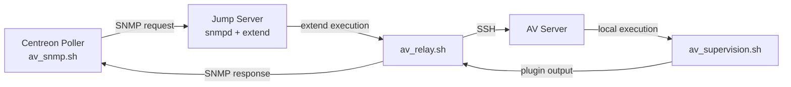

# AV Supervision Toolkit

<!-- TABLE OF CONTENTS -->
<details>
  <summary>Table of Contents</summary>
  <ol>
    <li><a href="#about">about</a></li>
    <li><a href="#architecture">architecture</a></li>
    <li><a href="#scripts">scripts</a></li>
    <li><a href="#installation">installation</a></li>
    <li><a href="#usage">usage</a></li>
    <li><a href="#faq">faq</a></li>
  </ol>
</details>

---

## about

AV Supervision Toolkit is an antivirus monitoring solution designed for restricted and segmented environments where the Centreon poller cannot directly reach the AV server.

- isolated AV server  
- jump server (bastion)  
- indirect supervision via SNMP and SSH  

## architecture

> [!IMPORTANT]
This architecture is designed for segmented environments where direct access between poller and target server is not allowed.



## scripts

The project is composed of multiple scripts distributed across different hosts.  
Each script has a specific role in the monitoring chain.

| script | location | role | description |
|--------|----------|------|------------|
| av_supervision.sh | av server | check | validates antivirus signatures and engines |
| av_relay.sh | jump server | relay | executes remote script via SSH |
| av_snmp.sh | centreon poller | entrypoint | queries SNMP and retrieves result |

These scripts work together to provide a complete monitoring workflow across segmented environments.

## installation

### 1. clone repository

```bash
git clone https://github.com/Pr0xyG33k/antivirus_monitoring.git
cd antivirus_monitoring
```

### 2. av server

```bash
cp av_supervision.sh /opt/antivirus_monitoring/
chmod +x /opt/antivirus_monitoring/av_supervision.sh
```

### 3. jump server

```bash
cp av_relay.sh /usr/lib/centreon/plugins/
chmod +x /usr/lib/centreon/plugins/av_relay.sh
```

```bash
extend check /usr/lib/centreon/plugins/av_relay.sh
systemctl restart snmpd
```

### 4. ssh configuration

```bash
ssh-keygen
ssh-copy-id user@av-server
```

### 5. centreon poller

```bash
cp av_snmp.sh /usr/lib/centreon/plugins/
chmod +x /usr/lib/centreon/plugins/av_snmp.sh
```

### 6. test

```bash
./av_snmp.sh <jump_server> <community> check
```

## usage

> [!NOTE]
The poller does not execute the antivirus check directly.  
The request is forwarded via SNMP to the jump server, which executes `av_supervision.sh` remotely over SSH.

### command

```bash
./av_snmp.sh <jump_server> <community> check
```

### options (av_supervision.sh)

`-w <int>`   warning threshold (default: 0)  
`-c <int>`   critical threshold (default: 1)  
`-t <int>`   HTTP timeout in seconds (default: 15)  
`-u <url>`   override update URL (default: auto)  
`-b <path>`  base directory for antivirus engines  
`-l <path>`  log directory  
`-v`         enable verbose mode  
`-h`         display help  

### return codes

`0` OK  
`1` WARNING  
`2` CRITICAL  
`3` UNKNOWN  

## faq

### why use a jump server instead of direct monitoring?
Direct access is restricted due to network segmentation.

### why use snmp extend?
Allows execution of remote scripts via SNMP.

### why is SSH required?
Used by the jump server to reach the AV server.

### why is only the exit code used?
Centreon determines the status based on exit code only.
