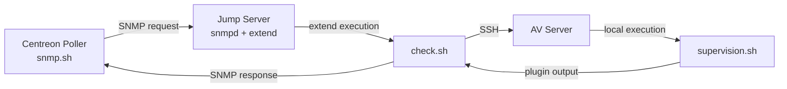

<!-- TABLE OF CONTENTS -->
<details>
  <summary>Table of Contents</summary>
  <ol>
    <li><a href="#about">about</a></li>
    <li><a href="#architecture">architecture</a></li>
    <li><a href="#scripts">scripts</a></li>
    <li><a href="#installation">installation</a></li>
    <li><a href="#usage">usage</a></li>
    <li><a href="#faq">faq</a></li>
  </ol>
</details>

---

## about

AV Supervision Toolkit is an antivirus monitoring solution designed for restricted and segmented environments where the Centreon poller cannot directly reach the AV server.

- isolated AV server  
- jump server (bastion)  
- indirect supervision via SNMP and SSH  

## architecture

> [!IMPORTANT]
This architecture is designed for segmented environments where direct access between poller and target server is not allowed.



## scripts
The project is composed of multiple scripts distributed across different hosts,
each script has a specific role in the monitoring chain:


| script | location | role | description |
|--------|----------|------|------------|
| supervision.sh | av server | check | validates antivirus signatures and engines |
| check.sh | jump server | relay | executes remote script via SSH |
| snmp.sh | centreon poller | entrypoint | queries SNMP and retrieves result |

These scripts work together to provide a complete monitoring workflow across segmented environments.

## installation

### 1. clone repository
Clone the repository on each host where scripts are required.

```
git clone https://github.com/Pr0xyG33k/AV-Supervision.git
cd AV-Supervision
```

### 2. av server
The AV server is responsible for executing the actual antivirus checks.

```
cp supervision.sh /opt/av-supervision/
chmod +x /opt/av-supervision/supervision.sh
```

### 3. jump server
The jump server acts as an intermediary between the monitoring system and the AV server.

```
cp check.sh /usr/lib/centreon/plugins/
chmod +x /usr/lib/centreon/plugins/check.sh
```

```
extend check /usr/lib/centreon/plugins/check.sh
systemctl restart snmpd
```

### 4. ssh configuration
The jump server must be able to connect to the AV server without user interaction.

```
ssh-keygen
ssh-copy-id user@av-server
```

### 5. centreon poller
The poller is responsible for initiating the monitoring request.

```
cp snmp.sh /usr/lib/centreon/plugins/
chmod +x /usr/lib/centreon/plugins/snmp.sh
```

### 6. test
Before integrating into Centreon, validate the full chain manually.

```
./snmp.sh <jump_server> <community> check
```

## usage

The monitoring workflow is initiated from the Centreon poller using the SNMP check script.
> [!NOTE]
The poller does not execute the antivirus check directly.  
The request is forwarded via SNMP to the jump server, which executes the check remotely over 

### command

`<jump_server>`: IP or hostname of the jump server  
`<community>`: SNMP community string  
`check`: SNMP extend identifier  

### options

The actual antivirus checks are performed by `supervision.sh` on the AV server,
the following options apply to this script:

`-w <int>`   warning threshold (default: 0)  
`-c <int>`   critical threshold (default: 1)  
`t <int>`   HTTP timeout in seconds (default: 15)  
`-u <url>`   override update URL (default: auto)  
`-b <path>`  base directory for antivirus engines  
`-l <path>`  log directory  
`-v`         enable verbose mode  
`-h`         display help  

### code

The scripts follow the standard Nagios/Centreon plugin convention,
exit codes are interpreted as follows:

`0`   **OK**        system up to date  
`1`   **WARNING**   threshold exceeded (definitions or engines)  
`2`   **CRITICAL**  outdated or invalid antivirus components  
`3`   **UNKNOWN**   script execution failure or misconfiguration  

## faq

### why use a jump server instead of direct monitoring?
Direct access to the AV server is restricted due to network segmentation,
the jump server acts as a controlled relay between SNMP and SSH.

### why use snmp extend?
SNMP extend allows remote command execution through SNMP,
making it compatible with Centreon without requiring direct SSH access.

### why is SSH required?
The AV server is not directly reachable from the poller,
SSH is used by the jump server to securely execute the check remotely.

### why is only the exit code used?
Centreon determines the service state exclusively from the script exit code,
the output message is only used for display.
