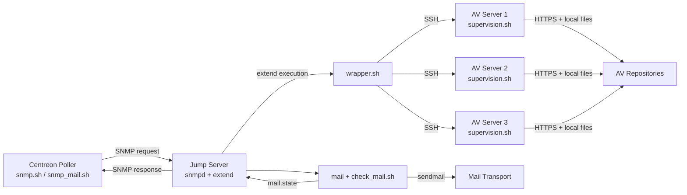

<p align="center">
  
<!--   -->
  
  
  
  
</p>

<p align="center">
  <a href="https://github.com/pullsec/antivirus_monitoring/issues">Report Bug</a>
  ·
  <a href="https://github.com/pullsec/antivirus_monitoring/pulls">Request Feature</a>
</p>

<!-- TABLE OF CONTENTS -->
<details>
  <summary>Table of Contents</summary>
  <ol>
    <li><a href="#about">about</a></li>
    <li><a href="#architecture">architecture</a></li>
    <li><a href="#scripts">scripts</a></li>
    <li><a href="#installation">installation</a></li>
    <li><a href="#usage">usage</a></li>
    <li><a href="#security">security</a></li>
    <li><a href="#faq">faq</a></li>
  </ol>
</details>

---

## about

AV Supervision Toolkit is based on a real-world enterprise scenario involving secure antivirus update distribution in a segmented environment. In this context, systems responsible for delivering antivirus updates are isolated from the monitoring infrastructure, requiring controlled mechanisms to verify update integrity, availability and consistency.

This project focuses on ensuring:

- successful delivery and availability of antivirus updates
- validation of definitions and engine freshness
- HTTP and TLS repository availability
- consistency between multiple antivirus servers
- reliable monitoring despite network segmentation
- monitoring of the automatic antivirus status mail report
- Centreon/Nagios-compatible return codes and output

The solution reflects operational constraints typically found in sensitive environments, where direct access is restricted and secure relay mechanisms are required.

## architecture

> [!IMPORTANT]
> This architecture is designed for segmented environments where direct access between the Centreon poller and antivirus servers is not allowed.


```mermaid
flowchart LR
    A[Centreon Poller<br/>snmp.sh / snmp_mail.sh]
    B[Jump Server<br/>snmpd + extend]
    C[wrapper.sh]
    D1[AV Server 1<br/>supervision.sh]
    D2[AV Server 2<br/>supervision.sh]
    D3[AV Server 3<br/>supervision.sh]
    E[AV Repositories]
    F[mail + check_mail.sh]
    G[Mail Transport]

    A -->|SNMP request| B
    B -->|extend execution| C
    C -->|SSH| D1
    C -->|SSH| D2
    C -->|SSH| D3
    D1 -->|HTTPS + local files| E
    D2 -->|HTTPS + local files| E
    D3 -->|HTTPS + local files| E
    B --> F
    F -->|sendmail| G
    F -->|mail.state| B
    B -->|SNMP response| A
```

The Centreon poller does not execute the antivirus supervision directly.

The request is sent through SNMP to the jump server. The jump server executes `wrapper.sh`, which launches `supervision.sh` remotely on the antivirus servers over SSH. Results are collected in parallel, compared and returned as a single monitoring status.

The first server configured in `wrapper.sh` is used as the functional reference for cross-server consistency checks.

A separate monitoring chain is available for the automatic HTML mail report through `mail`, `check_mail.sh` and `snmp_mail.sh`.

## scripts

The project is composed of multiple scripts distributed across different hosts.
Each script has a specific role in the monitoring chain.

| script | location | role | description |
| --- | --- | --- | --- |
| `supervision.sh` | av server | check | validates antivirus definitions, engines, repository access and TLS certificate health |
| `wrapper.sh` | jump server | relay / aggregation | executes remote checks over SSH, collects results in parallel and compares servers |
| `snmp.sh` | centreon poller | entrypoint | queries a Net-SNMP extend and retrieves its output and return code |
| `mail` | jump / reporting server | reporting | generates the HTML antivirus status report and submits it through sendmail |
| `check_mail.sh` | jump / reporting server | check | validates the status and freshness of the latest automatic mail report |
| `snmp_mail.sh` | centreon poller | entrypoint | retrieves the mail monitoring result through SNMP |
| `check_rc.sh` | admin host | diagnostic | displays the remote return code of each antivirus server |
| `check_time.sh` | admin host | diagnostic | measures the remote execution time of the antivirus supervision |

These scripts work together to provide a complete monitoring workflow across segmented environments.

## installation

### 1. clone repository

```bash
git clone https://github.com/pullsec/antivirus_monitoring.git
cd antivirus_monitoring
```

### 2. av servers

Install `supervision.sh` on every antivirus server:

```bash
mkdir -p /opt/antivirus_monitoring
cp scripts/supervision.sh /opt/antivirus_monitoring/
chmod 755 /opt/antivirus_monitoring/supervision.sh
```

Edit the configuration values before deployment:

```bash
BASE_AV_DIR="/path/web/to/the/update/av"
LOG_DIR="/path/to/the/antivirus/log"
INTEGRATION_SERVER="server4"
```

Configure the repository URL associated with each antivirus server inside `SERVERS_URLS`.

The local engine manifest path must also match the real antivirus repository layout.

### 3. jump server

Install the aggregation script:

```bash
cp scripts/wrapper.sh /usr/lib/centreon/plugins/
chmod 755 /usr/lib/centreon/plugins/wrapper.sh
```

Configure the remote supervision path and the antivirus server list:

```bash
REMOTE_SCRIPT="/opt/antivirus_monitoring/supervision.sh"

SERVERS=(
    "server1"
    "server2"
    "server3"
)
```

The first server is the reference server used by `wrapper.sh` when comparing monitoring results.

### 4. ssh configuration

The jump server must be able to execute the supervision script remotely without an interactive password prompt.

```bash
ssh-keygen
ssh-copy-id user@server1
ssh-copy-id user@server2
ssh-copy-id user@server3
```

Test the connection manually:

```bash
ssh user@server1 /opt/antivirus_monitoring/supervision.sh
```

`wrapper.sh` uses `BatchMode=yes` and an SSH connection timeout.

By default, new host keys can be accepted automatically with `StrictHostKeyChecking=accept-new`.
For production environments, populate `known_hosts` beforehand and use:

```bash
export SSH_STRICT_HOST_KEY_CHECKING=yes
```

### 5. snmp configuration

Expose `wrapper.sh` through Net-SNMP on the jump server.

Example `/etc/snmp/snmpd.conf` configuration:

```text
extend check_av /usr/lib/centreon/plugins/wrapper.sh
```

If mail monitoring is required:

```text
extend check_av_mail /usr/lib/centreon/plugins/check_mail.sh
```

Restart the SNMP service:

```bash
systemctl restart snmpd
```

### 6. centreon poller

Install the SNMP entrypoints:

```bash
cp scripts/snmp.sh /usr/lib/centreon/plugins/
cp scripts/snmp_mail.sh /usr/lib/centreon/plugins/
chmod 755 /usr/lib/centreon/plugins/snmp.sh
chmod 755 /usr/lib/centreon/plugins/snmp_mail.sh
```

Test the antivirus monitoring chain:

```bash
./scripts/snmp.sh <jump_server> <community> check_av
```

Test the mail monitoring chain:

```bash
./scripts/snmp_mail.sh <jump_server> <community> check_av_mail
```

### 7. mail reporting

The `mail` script generates an HTML report containing antivirus definition and engine status information.

It requires KornShell and a sendmail-compatible local mail transport.

Configure at least:

```bash
MAIL_TO="mail@test.fr"
MAIL_CC="mail2@test.fr"
MAIL_FROM="Antivirus"
STATUS_FILE="/path/to/the/file/mail.state"
```

The same `STATUS_FILE` must be configured in `check_mail.sh`.

The state file should be stored in a directory writable only by the account executing the report.

### 8. test

Test each layer independently before configuring the Centreon service:

```bash
# local antivirus check
./scripts/supervision.sh -v

# jump server aggregation
./scripts/wrapper.sh

# SNMP monitoring chain
./scripts/snmp.sh <jump_server> <community> check_av

# mail monitoring chain
./scripts/check_mail.sh
./scripts/snmp_mail.sh <jump_server> <community> check_av_mail
```

## usage

> [!NOTE]
> The poller does not execute the antivirus check directly.
> The request is forwarded via SNMP to the jump server, which executes `supervision.sh` remotely over SSH through `wrapper.sh`.

### command

```bash
./scripts/snmp.sh <jump_server> <community> check_av
```

### options (supervision.sh)

`-w <int>` warning threshold used in performance data

`-c <int>` critical threshold used in performance data

`-t <int>` HTTP timeout in seconds (default: 15)

`-u <url>` override antivirus repository URL

`-b <path>` override antivirus engine base directory

`-l <path>` override log directory

`-v` enable verbose mode

`-h` display help

Example:

```bash
./scripts/supervision.sh -v -t 20
```

### tls behavior

TLS verification is enabled by default.

`supervision.sh` checks repository certificate availability and expiration. An insecure curl fallback exists only for troubleshooting and is disabled by default.

Temporary troubleshooting example:

```bash
ALLOW_INSECURE_TLS=1 ./scripts/supervision.sh -v
```

This mode should not be used as a permanent production configuration. The correct internal CA chain should be installed in the system trust store instead.

### return codes

`0` OK

`1` WARNING

`2` CRITICAL

`3` UNKNOWN

Centreon determines the service state from these return codes.

### diagnostic scripts

Display the return code from each remote antivirus server:

```bash
./scripts/check_rc.sh
```

Measure the execution time of each remote antivirus check:

```bash
./scripts/check_time.sh
```

## security

The monitoring chain crosses multiple security zones. The following controls are recommended for production environments:

- use a dedicated unprivileged SSH monitoring account
- restrict the SSH account to the required supervision command when possible
- pre-populate SSH host keys and use `StrictHostKeyChecking=yes`
- restrict SNMP access to the Centreon poller with firewall rules and SNMP ACLs
- prefer SNMPv3 with authentication and encryption when supported by the monitoring architecture
- keep TLS verification enabled and install the internal CA chain
- restrict write access to scripts, logs and `mail.state`
- never commit production credentials, SSH private keys, SNMP communities or sensitive internal URLs to the public repository

## faq

### why use a jump server instead of direct monitoring?

Direct access is restricted due to network segmentation.
The jump server provides a controlled relay between the monitoring infrastructure and the antivirus servers.

### why use snmp extend?

It allows Centreon to retrieve the result of a locally executed monitoring command through Net-SNMP without providing direct SSH access from the poller to the antivirus servers.

### why is SSH required?

SSH is used by `wrapper.sh` on the jump server to execute `supervision.sh` on each antivirus server.

### why does wrapper.sh check multiple servers?

The antivirus infrastructure contains multiple servers that should expose consistent update information. `wrapper.sh` executes checks in parallel and compares the results with the first configured server.

### what does supervision.sh check?

The script validates antivirus definition freshness, local engine information, repository HTTP availability and TLS certificate health. It returns a Centreon/Nagios-compatible status.

### how is the automatic mail report monitored?

The `mail` script writes its latest execution status to `mail.state`. `check_mail.sh` validates the status and age of this file, and `snmp_mail.sh` allows Centreon to retrieve the result through SNMP.

### does a successful mail status guarantee delivery to the mailbox?

No. The script confirms that the message was successfully submitted to the local sendmail-compatible transport. Final delivery depends on the downstream mail infrastructure.

### why are only standard return codes used?

Centreon/Nagios plugins use standard return codes to determine service state: `0` for OK, `1` for WARNING, `2` for CRITICAL and `3` for UNKNOWN.
